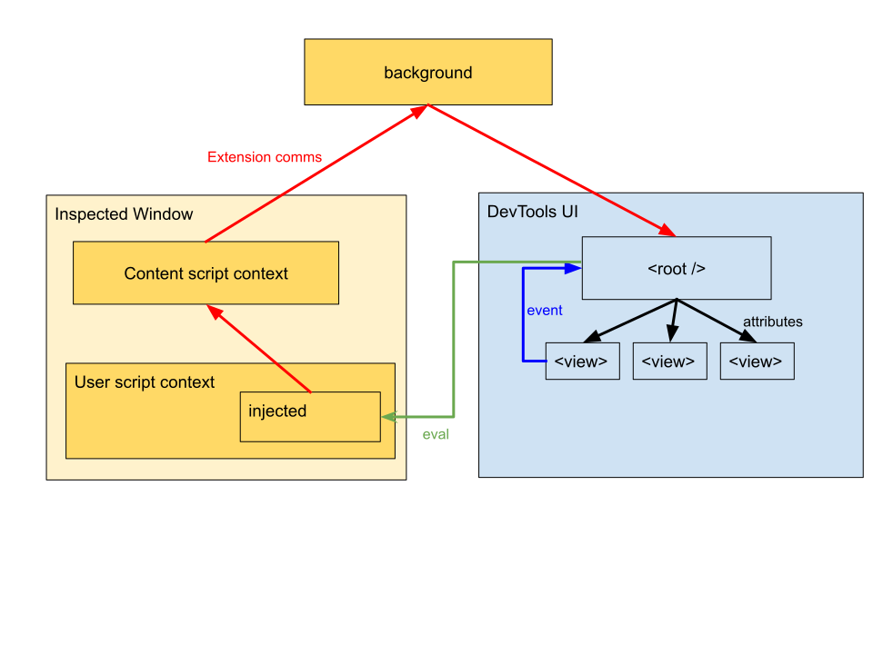

# Development

**three-devtools** is a web extension that allows inspection of content in a three.js environment.using [web components] for the UI.

## Commands

* `npm run build:deps` builds dependencies via [@pika/web]
* `npm run build:dist` builds a zip file of the extension in the `dist/*` directory for non-Chrome browsers.
* `npm run build:dist:chrome` builds a zip file of the extension in the `dist/*` directory for Chrome. Chrome does not recognize the web extension manifest key `browser_specific_settings`, and requires a special build to fix this warning.
* `npm run build:source` builds a zip file of the source files for the extension (sans dependencies from npm) for AMO reviews in order to build the extension.

## Local Development

### Firefox

Using [web-ext](https://extensionworkshop.com/documentation/develop/getting-started-with-web-ext/) allows local development via Firefox. `web-ext run` in the project directory.

### Chrome

In `chrome://extensions`, load the extension *unpacked*.

A (benign) warning will appear referencing the `browser_specific_settings` key in `manifest.json` as unrecognized. Everything else works as expected.

## Building

Running `npm run build:dist` creates a zip of the extension in `./dist`.

Running locally as an unsigned extension on Firefox requires Developer Edition, Nightly or ESR and `xpinstall.signatures.required` in `about:config` ([source](https://developer.mozilla.org/en-US/docs/Mozilla/Add-ons/WebExtensions/Distribution_options#Signing_your_extension)).

Chrome requires its own build since it does not recognize `browser_specific_settings` in the web extension manifest. Run `npm run build:dist:chrome` to create a build specifically for Chrome in `./dist`. This will then need to be packed as a `.crx` via "Pack Extension" in `chrome://extensions`.

## Publishing

Before publishing:

* Test Firefox via `web-ext run`
* Test Chrome via unpacked extension in `chrome://extensions`
* Increment the version via `npm version [major | minor | patch]`. This will update the version across `package.json`, `manifest.json` and tag and push to the git origin.

### Firefox

* `npm run build:dist` and `npm run build:source`
* Go to [Three.js Developer Tools AMO Page](https://addons.mozilla.org/en-US/developers/addon/three-js-developer-tools) and upload build `dist/three.js_developer_tools_*.zip`
  * Since [@pika/web] is used to bundle dependencies, according to AMO's [source code submission policy](https://developer.mozilla.org/en-US/Add-ons/Source_Code_Submission), source code also needs to be uploaded. Upload `dist/three-devtools-source.zip`
  * TODO Should add a markdown page for AMO reviewers to easily recreate builds
* Ensure minimum Firefox version is updated -- latest release version (or maybe ESR?).

### Chrome

* Build extension for Chrome: `npm run build:dist:chrome`
* Go to [Chrome's Developer Dashboard](https://chrome.google.com/webstore/developer/dashboard) and *edit* the Three.js Developer Tools entry, and upload `dist/three.js_developer_tools_*.zip`
  * Accept the review notice that it'll take some time due to the broad permissions.

## Technology & Background

Devtools extensions run in several different processes and communicating between content, background scripts and devtools pages requires some plumbing. See [Extending DevTools](https://developer.chrome.com/extensions/devtools) for more details.

The UI is created using [web components](https://developer.mozilla.org/en-US/docs/Web/Web_Components), a suite of technologies including custom elements, shadow DOM, and templates. The custom elements are use [LitElement] to provide a React-ish way of defining elements. There are some caveats and roadbumps that devs can encounter if new to web components; some resources below that may be useful:

* [Shadow DOM cheat sheet](https://gist.github.com/praveenpuglia/0832da687ed5a5d7a0907046c9ef1813)
* [Event bubbling when crossing shadow boundaries](https://javascript.info/shadow-dom-events)

## Directory Structure

* **src/app/**: The frontend code for the UI inside of devtools.
* **src/extension/**: Scripts for handling the communication plumbing for the devtools, background and content script processes.
* **src/content/**: Scripts that are evaluated within user-script context, and will have access to the relevant three.js instances. **Note** currently this content is injected in a content script context as a string, and later injected due to extension injected bug (#1).
* **src/shared/**: Scripts that are shared between contexts.
* **web_modules/**: Built module dependencies.

## Architecture



### Extension Communication

Data from a three.js scene must travel from the injected script, ([src/content/](src/content/)), to the content script context ([src/extension/contentScript.js](src/extension/contentScript.js)), then to the background script ([src/extension/background.js](src/extension/background.js)), which then sends the message to the corresponding devtools context for that inspected window if it exists ([src/extension/devtools.js](src/extension/devtools.js)), and then to its corresponding iframe, running the frontend app ([src/app/index.html](src/app/index.html)). 

To complete the cycle, the frontend app directly evaluates into the user script context, interacting with the injected `ThreeDevTools` singleton's private methods.

User-land code can register the inspected scene and renderer via the singleton API:

```js
if (window.ThreeDevTools) {
  window.ThreeDevTools.connect({ scene, renderer });
}
```

### Injection

Currently the content script is included on every page, which then injects `window.ThreeDevTools` synchronously into the user content context so that content can register itself.

### Front end

The UI is constructed using [web components] with [LitElement]. LitElements have a defined [lifecycle](https://lit-element.polymer-project.org/guide/lifecycle) and pass attributes/properties to their children elements, similar to React components. The root element (currently `<three-devtools-app />`) manages the state of the application: some subset of the content's three.js state, any UI state, and any extension preferences. As the state changes, the attributes flow down the tree via LitElement's rendering.

To make a state change from the UI, events can be fired ("commands") where they're processed by the root element.

The end result is that changes from content or from events are handled by the root element, which may cause a rerender, changes propagating downward through the DOM tree, similar to using React with [Redux communication](https://code-cartoons.com/a-cartoon-intro-to-redux-3afb775501a6).

Note that due to using UUID attributes and using that to reference the store to get the latest information of an entity, an element can force rerender even though attributes have not changed to get the latest data for an entity.

#### BaseElement

There's [`BaseElement`](src/app/elements/BaseElement.js) that many components inherit from. This offers a `uuid` attribute, which when set, will rerender the element whenever it detected a state change for the entity with that UUID. This is managed through the root element, but each BaseElement also can handle its own update, deviating a bit from the above data flow (although state still managed by the root, elements subcribing to a subset of that state). Maybe this circumvention would be less of an issue if I more consistently used properties rather than attributes in LitElement.

#### Terms/Patterns

* View Elements are the larger panels inside the tool. Probably should inherit from the same base at some point.
* Value Elements ([src/app/elements/values/](src/app/elements/values)) are input components that can be used in the GUI to represent different data types like an integer with a slider, or a material with a small preview inside of another view to be edited. 
* `entity` is used to refer to any type of three.js instance: object, material, texture, etc. (due to "object" being a specific type)
* `typeHint` is used to mean what category type of an entity, with an unfortunate name (due to "type" referring to class name in three.js). This is so components can respond differently to differently typed entities. In the future, could be a utility perhaps rather than storing on the data object itself. Current `typeHint`s:
  * 'object'
  * 'material'
  * 'texture'
  * 'image'
  * 'geometry'
  * 'shape'

## Developing

* Clone this repo.

```
$ git clone git@github.com:jsantell/three-devtools.git
$ cd three-devtools
$ npm install
```

* Install the extension as an [unpacked extension](https://developer.chrome.com/extensions/getstarted).
* The extension should now run
* Developer tools can be called for the extension panel itself via right click -> inspect. If making changes only to `src/app` code, refreshing this panel is sufficient.
* Changing code in `./src/content/*` and `./src/extension/*` require refreshing the extension (e.g. in `chrome://extensions`)

## Dependencies

three-devtools is using [@pika/web](https://www.pikapkg.com/blog/pika-web-a-future-without-webpack/) for building dependencies, handling the dependency graph into an ES module, resulting in needing no "build" between iterations. Call `npm run build` if updating the dependencies and regenerating `web_modules/`.

## Questions/Rationales

### Why is the communication so complex?

Serialized communication between user-land content (e.g. three.js) and a panel in the developer tools must jump through 4 different contexts (injected/user, content script, background, devtools/app) due to the [architecture of extensions themselves](https://developer.chrome.com/extensions/devtools). This certainly makes things more complex, and there does not yet exist a good abstraction around this that I've found. Luckily, the boilerplate-esque communication code will have a low frequency of change.

There's an alternative form of communication, using the devtools' ability to [evaluate in the inspected window's user context](https://developer.chrome.com/extensions/devtools_inspectedWindow#method-eval), enabling the possibility of [polling globals from devtools](https://github.com/GoogleChrome/devtools-docs/issues/143). Infact, this is how the devtools panel communicates with the injected code:

```js
chrome.devtools.inspectedWindow.eval(`ThreeDevTools.METHOD(${value})`);
```

The commands are simple, small values, indicating a value change or a request. The reverse direction (content to devtools) must handle large textures as base64 strings, which incurs significant jank when pulling via `eval` polling, which is why the more complex port messaging system is used.

The Devtools -> Content communication could also use port messaging in the future; `eval` was chosen purely for development speed, and since large data does not currently travel in this direction.

### Why is injection so weird?

Content scripts have access to the DOM, but cannot access any globals from user-land script (e.g. code from script elements on a page). In order to access the three.js entities on the page, an additional script needs to be injected as if it were regular user-land script, by literally injecting a `<script>` element with our injection code.

There are a few options to handle this.

* Synchronous injection at document_start
  * This is the current implementation. Non-ideal as this is evaluated on *every* page load, and injecting content on *every* page load. This is what [redux-devtools](https://github.com/zalmoxisus/redux-devtools-extension) does, with a rather large content script. The challenge here is defining some object in the user context immediately (`window.ThreeDevTools`) so that content can access it, even if it's defined in the `<head>`.
  * I attempted a system where opening devtools lands a cookie allowing that domain to inject content for the next few minutes, as cookies can be checked synchronously to determine if injection is needed. Was flaky, but due to extension confusion I think.
  * The global indicates that the extension is *installed*, not open, if that matters to the content.
  * Need to set text content rather than src of injection script to guarantee sync inject (#1).
* Port messaging
  * Something like `window.postMessage({ type: 'three-devtools-connect' })` that doesn't need to exist in global space before content runs, so synchronous code injection no longer needed.
  * Could have a purely `postMessage` API and no global.
  * Less inspectable than a singleton
  * Moves code from injected code to content script code -- could the extra content script be lazily brought in on first sign of a post message?

[@pika/web]: https://github.com/pikapkg/web
[LitElement]: https://lit-element.polymer-project.org
[web components]: https://developer.mozilla.org/en-US/docs/Web/Web_Components
